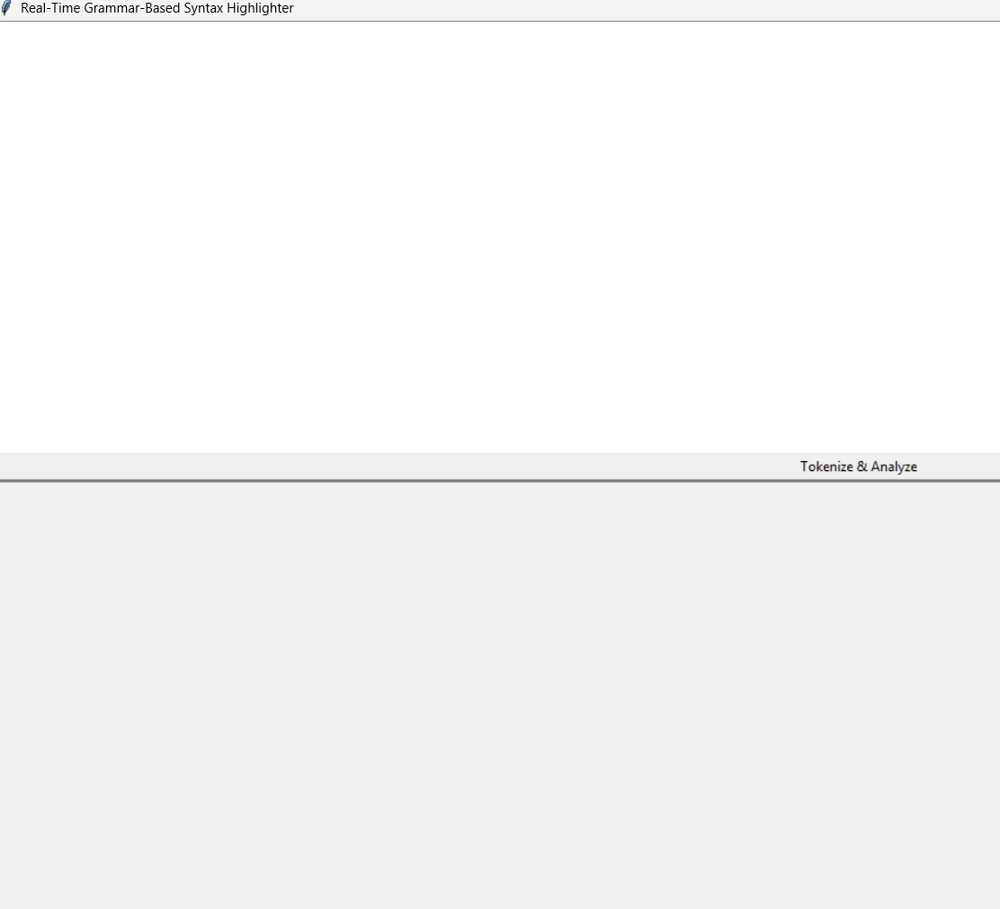
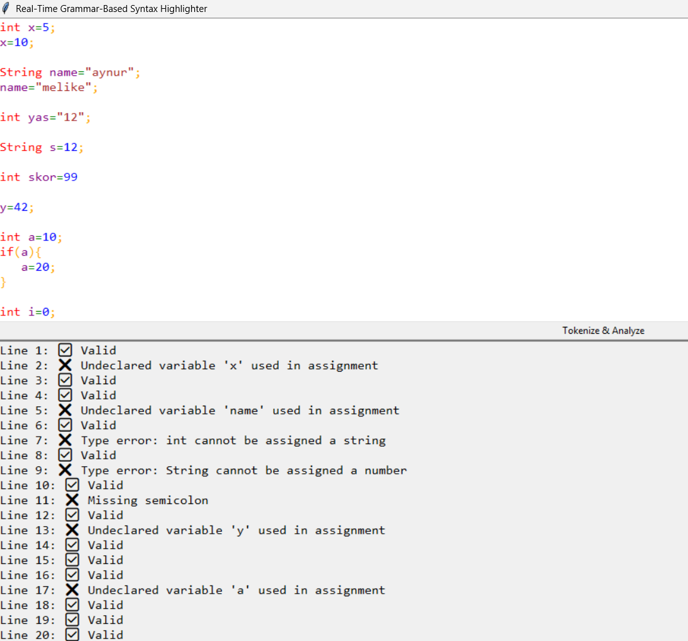

# Gerçek Zamanlı Sözdizimi Vurgulayıcı (Real-Time Grammar-Based Syntax Highlighter)

Bu proje, gerçek zamanlı çalışan bir sözdizimi vurgulayıcı (syntax highlighter) ve grafiksel kullanıcı arayüzü (GUI) içermektedir. Proje, belirli gramer kurallarına göre sözdizimsel ve sözcüksel analiz gerçekleştirir. Harici bir sözdizimi vurgulama kütüphanesi kullanılmamıştır.

## 🚀 Özellikler

- Gerçek zamanlı sözcüksel ve sözdizimsel analiz
- En az 5 farklı token türü için renkli vurgulama
- Python dili ve Tkinter GUI kullanılarak geliştirildi
- Hatalı tip kullanımları ve sözdizimi hataları tespit edilir
- Girdi alanı üstte, analiz çıktısı altta olacak şekilde kullanıcı dostu arayüz
- Yazım ile eş zamanlı analiz ve vurgulama

## 🛠️ Kullanılan Teknolojiler

- **Python**
- **Tkinter (GUI)**
- **Regex (Düzenli ifadeler)**
- **Recursive Descent Parsing (Top-Down Parser)**

## 🧠 Sözcüksel Analiz

Sözcüksel analizde, kullanıcı girişi belirlenen regular expression'lar aracılığıyla ayrıştırılır.

### Tanınan Token Türleri

- Anahtar kelimeler (`int`, `if`, `string`, `else`, `while`, `return`)
- Tanımlayıcılar (değişken/ad fonksiyon isimleri)
- Operatörler (`+`, `-`, `*`, `/`, `=`)
- Noktalama işaretleri (`;`, `:`, `(`, `)`, `{`, `}`)
- Sayılar
- String
- Yorumlar

## 📘 Sözdizimi Analizi

Recursive Descent Parser yöntemi ile yazılmıştır. Aşağıdaki bağlamdan bağımsız gramer (CFG) kullanılmıştır:

```
Program -> StmtList
StmtList -> Stmt StmtList | ε
Stmt -> DeclStmt | AssignStmt
DeclStmt -> Type id ;
AssignStmt -> id = Expr ;
Type -> int | float | string
Expr -> Term Expr'
Expr' -> + Term Expr' | - Term Expr' | ε
Term -> Factor Term'
Term' -> * Factor Term' | / Factor Term' | ε
Factor -> id | number | ( Expr )
```

## 🎨 Vurgulama Renkleri

| Token Türü | Renk     |
|------------|----------|
| Anahtar Kelime | Kırmızı   |
| Tanımlayıcı   | Mor |
| Operatör      | Yeşil |
| Sayı         | Mavi  |
| Ayraç  | Turuncu |
| Yorum  | Gri |
| String  | Kahverengi |

## Proje Çalışma Görselleri




## 📺 Demo Videosu

👉 [Demo Videosunu İzle](https://www.youtube.com/watch?v=nCBGt286roQ)

## 📄 Makale

👉 - 📖 [Makaleyi oku](https://medium.com/@aynuradibelli27/ger%C3%A7ek-zamanl%C4%B1-s%C3%B6z-dizimi-vurgulay%C4%B1c%C4%B1-python-ve-tkinter-ile-geli%C5%9Ftirilmi%C5%9F-bir-uygulama-e17a8603737f)

## 📄 Final Raporu

[Final Raporu (pdProje_FinalRaporu.docx)](pdProje_FinalRaporu.docx)

## 🔧 Nasıl Çalıştırılır?

1. Python 3 yüklü olduğundan emin olun
2. Depoyu klonlayın:

   ```bash
   git clone [(https://github.com/Aynur-Ad/ProgramlamaDilleri_Proje)]
   ```

3. Uygulamayı başlatın:

   ```bash
   python pd_proje.py
   ```

## 📂 Dosya Yapısı

```
├── pd_proje.py
├── README.md
```
